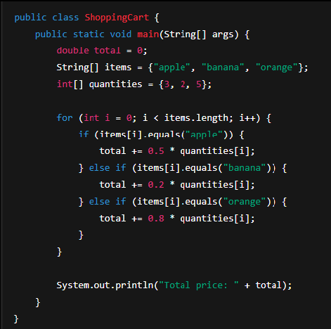

# Úvod do návrhových vzorů
## Klasifikace návrhových vzorů
1. **idiomy** - nejzákladnější a nízkoúrovňové
2. **architektonické vzory** - nejuniverzálnější
3. **Creational patterns** - pro vytváření objektů, zvyšujících flexibilitu a znovupoužitelnost
4. **Structural patterns** - jak sestavovat subjekty a třídy do celků, zůstávají flexibilní a efektivní
5. **Behavioral patterns** - komunikace a rozdělení odpovědností mezi objekty

### Credentional patterns
- Abstract Factory
- Builder
- Factory Method
- Prototype
- Singleton

### Structural patterns
- Adapter
- Bridge
- Composite
- Decorator
- Facade
- Flyweight
- Proxy

### Behavioural patterns
- Chain of Responsibility
- Command
- Interpreter
- Iterator
- Mediator
- Memento
- Observer
- State
- Strategy
- Template Method
- Visitor

## Antipatern
- podobné vzorům s rozdílem, že místo řešení nabízí něco, co na první pohled vypadá jako řešení, ale ve skutečnosti jím není
- Nejlépe se jim vyhnout
- běžné chyby nebo špatné postupy
- Mohou vést k
  - zvýšené složitosti
  - sníženmá udržovatelnost

### Spaghetti code

- není oddělená 